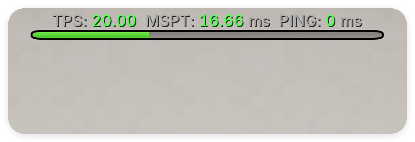

# TPSBar

[简体中文](README.md) | [English](README.en.md)

TPSBar is a Rust/WASM plugin for Pumpkin servers. Each player can independently toggle their performance BossBar with `/tpsbar`. Their choice is stored in the plugin's private data directory and persists across reconnects and server restarts.



This is a third-party Pumpkin plugin developed by PING and is not affiliated with, sponsored by, or endorsed by the PumpkinMC organization.

```text
TPS: 20.00  MSPT: 19.24 ms  PING: 8 ms
```

The interface layout is inspired by the familiar TPSBar design in Purpur.

## Features

- Disabled by default and only shown to players who explicitly run `/tpsbar`.
- Independent BossBar, ping value, and persistent preference for every player.
- Reads TPS, MSPT, and ping through official Pumpkin APIs without modifying the world or game logic.
- Fills the BossBar by MSPT by default: `50 MSPT` fills the bar; switch the metric in config or with `/tpsbar by mspt|tps|ping`.
- Color-coded TPS, MSPT, and ping values, with light-gray labels and units.
- Refreshes every 20 ticks by default, using one server sample for all enabled players.
- Available to Pumpkin permission level 3 (administrator) and above by default.
- Built-in Simplified Chinese and English messages selected from each client's locale, with a configurable fallback locale.
- Removes only BossBars owned by this plugin when a player disconnects, loses permission, or the plugin unloads.

## Permission

| Node | Default | Purpose |
| --- | --- | --- |
| `tpsbar:command.toggle` | `op level 3` | Toggle the sender's own TPSBar |

Pumpkin currently requires plugin permissions to use the `plugin-namespace:node` format, so this differs from the dot-separated nodes commonly used by Bukkit and Paper. The default level can be configured from `0` through `4`; level `0` makes the command available to regular players by default.

## Configuration and data

On first load, TPSBar creates `config.toml` inside the private data directory assigned by Pumpkin. See [`assets/config.default.toml`](assets/config.default.toml) for all default values.

Default MSPT color ranges:

- `[0, 35)`: green
- `[35, 50)`: yellow
- `[50, 80)`: gold
- `[80, +∞)`: red

BossBar progress defaults:

- `bar.metric = "mspt"`: fills at `bar.mspt_full` (50 by default).
- `bar.metric = "tps"`: uses the configured target TPS (20 by default) as full.
- `bar.metric = "ping"`: fills at `bar.ping_full` (200 by default).

Administrators can switch the live metric with `/tpsbar by mspt`, `/tpsbar by tps`, or `/tpsbar by ping`. The command changes the current server instance; after a restart, the plugin config is used again.

The state file is versioned JSON. Saves use a temporary file and backup recovery flow so an interrupted write does not directly corrupt the existing preferences.

## I18N strategy

TPSBar selects messages from each player's client-reported locale instead of forcing one server-wide language through configuration. Version 0.1.0 includes `zh_cn` and `en_us`; `fallback_locale` is used only when the client language is unsupported.

Pumpkin provides an official I18N WIT, but the current host conversion from locale enums to locale strings causes many languages to fall back to English unexpectedly. This version therefore uses the official `Player.get_locale()` source and resolves messages through embedded plugin catalogs. It can migrate to the shared translation registry after the official conversion layer is fixed and stabilized.

## Building

Rust 1.95 or later and the `wasm32-wasip2` target are required. The repository includes `rust-toolchain.toml` to pin the verified toolchain:

The Plugin API is pinned to the official Pumpkin Git dependency at commit `0844e929112d5cda772bc8b0de51e38930142704`, so local and CI builds use the same API.

```powershell
rustup target add wasm32-wasip2
cargo +1.95.0 fmt --check
cargo +1.95.0 test --target x86_64-pc-windows-msvc
cargo +1.95.0 clippy --target x86_64-pc-windows-msvc --all-targets -- -D warnings
cargo +1.95.0 build --release
```

`.cargo/config.toml` sets `wasm32-wasip2` as the default target. Cargo's raw output is written to `target/wasm32-wasip2/release/tpsbar.wasm`; GitHub Actions and Releases copy it to the versioned name `tpsbar-v0.1.wasm`.

GitHub Actions runs formatting, tests, Clippy, and a WASM release build on pushes, pull requests, and manual dispatches, then uploads the WASM artifact for download.

### Toolchain compatibility note

As of Pumpkin commit `0844e929112d5cda772bc8b0de51e38930142704`, the official WIT contains identifiers such as `generic-9x1` that violate the Component Model kebab-case rules. The `wasm-component-ld 0.5.15` bundled with the default Rust 1.90 toolchain rejects this WIT during final componentization; this project verified that Rust 1.95's `wasm-component-ld 0.5.21` produces a loadable release WASM. A static scan found 91 similar candidates across five WIT files, so the first linker error is not an isolated case.

This is not a TPSBar business-logic error. Rust 1.95 has been verified to produce a loadable release WASM; upgrade the Rust toolchain when using an older linker. The plugin must still match the target Pumpkin WIT/API.

## Installation

Place `tpsbar-v0.1.wasm` from the Release in Pumpkin's plugin directory and start the server. On first load, Pumpkin asks for the plugin's two private data-directory permissions. TPSBar requests only:

- `fs.read.data`
- `fs.write.data`

It does not request network access, system information, or filesystem access outside its private data directory.

## Compatibility

- Java clients: support segmented rich-text colors in the title.
- Bedrock clients: Pumpkin currently converts BossBar titles to plain text. Values and the BossBar color remain visible, but per-segment title colors may be lost.
- TPS is capped at the configured target value, avoiding values above 20 from the raw official `1000 / MSPT` calculation when MSPT is very low.

## License

Copyright 2025-2026 PING

Licensed under the [Apache License 2.0](LICENSE). See [THIRD-PARTY-NOTICES.md](THIRD-PARTY-NOTICES.md) for the dependency summary and `LICENSES/` for archived license texts. After updating the lockfile, run:

```powershell
./scripts/update-licenses.ps1
```
